# Software Design Document TWIOO-AAS-Manager
The following document specifies the architecture, requirements and development standards (methodology) for **TheWorldIsOneObject-AssetAdministrationShell-Manager** (short: TWIOO-AAS-Manager). 

This document is for anyone working on the development side. For a Manuel go [here]().

## Acronyms
| Acronym | Description                |
| ------- | -------------------------- |
| AAS     | Asset Administration Shell |

---

## Development Methodology
The following section explains Version Control, Style of Code, Distribution Mechanisms of finalized Versions and Contribution Guidelines to the TWIOO-AAS-Manager.

### Version Control
- This repository is maintained by utilizing Git. 
- Github is functioning as the Online-Storage of choice.
- This repository stores Source Code and the finalized Documentation as well as most of it's Assets.

### Style of code
_Note: see this [issue](https://github.com/TheWorldIsOneObject/twioo-aas-manager/issues/26) for more information._

### Distribution Mechanisms
_Note: see this [issue](https://github.com/TheWorldIsOneObject/twioo-aas-manager/issues/21) for more information._

### Contribution Guidelines
_Note: see this [issue](https://github.com/TheWorldIsOneObject/twioo-aas-manager/issues/3) for more information._

---

## Software Requirements
The TWIOO-AAS-Manager is a Desktop application to view, create, edit and manage Digital Twins based on the Asset Administration Shell locally or on a given network. The intended Users are people working with AAS as base for Digital Twins or adjusted technologies. Some use cases can be found [here](UseCase-AasManagement.md).

### User needs
- view related:
    - intuitive GUI
    - clear and understandable Error messages (Error catalog)
    - easy access to report problems
    - Network: auto value update option (maybe toggle via button?)
- create related:
    - integrated helper to find mistakes in AAS
    - integrated access to typical AAS repositories (e.g. Concept Description)
    - (maybe) some kind of autocompletion?
    - save locally/upload to server functionalities
- edit related:
    - load locally/ from network
- managing related:
    - locally:
        - simple file explorer functionalities
    - network:
        - view, edit, deploy AAS in a given AAS-Environment (only network AAS-Environment related information)
             
### Assumptions and Dependencies: 
- Assumptions:
    - Desktop Application -> Language which is operating system independent (e.g. Java for Windows, Mac OS, Linux)
    - Standalone Application with packed JRE ref: [here](https://stackoverflow.com/questions/13996547/how-do-i-bundle-a-jre-into-an-exe-for-a-java-application-launch4j-says-runtime)
- Dependencies:
    - [AAS-Specifications](https://industrialdigitaltwin.org/en/content-hub/aasspecifications)
        - especially Part1: Metamodell, Part2: API and Part 5: AASX
        - API will be HTTP/REST
        - Metamodell Serialization [AAS4j](https://github.com/eclipse-aas4j/aas4j) -> Apache 2.0 License
        - AASX packages are AAS serialized using [XML Architecture](https://www.w3schools.com/xml/xml_tree.asp)
- Performance:
    - different Graphics Themes and maybe Drivers
        - graphical driver which is low in computing power and can work with CPU and/or GPU and/or APU
    - how to handle big AAS (like 500 entry)
- Security:
    - Creating a Group Right System so administrators can block certain features of the application
    - For Network Features: Login Masks? depending on Protocols/technologies

---

## Software Design
### Design Methodology
#### Goal
Well structured and easy to read Design Documentation to put inside of the application as an addition to the user manuel.

#### Tools
- Add list Tools that are used for Designing the Software
    - draw.io
    - GitHub (Flavored) Markdown
    - MS Paint for early GUI Drafts

#### Design Principles and Guidelines
_Note: see this [issue](https://github.com/TheWorldIsOneObject/twioo-aas-manager/issues/3) for more information._

### Software Architecture pattern
#### Event driven layer Architecture
- event driven layer based application

#### OOP & Additional Resources
- explain why these principals and goals are key to the proposed system
- explain OOP in connection with the AAS (short/simple explanation)
- [Refactoring Guru's Pattern Catalog](https://refactoring.guru/design-patterns/catalog)

_Note: All above this note is managed by this [issue](https://github.com/TheWorldIsOneObject/twioo-aas-manager/issues/19). All below this note is managed by its own issues. (So no Link to one specific Issue).

### Detailed Software Architecture
#### General View 
Architecture Draft
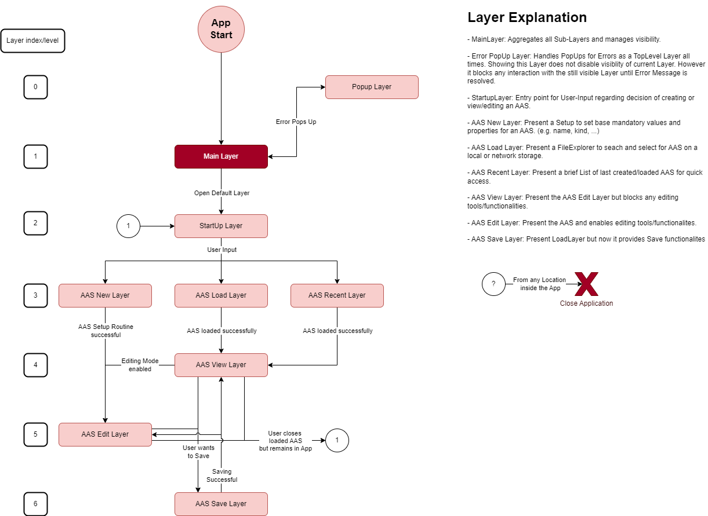

#### Subsystem: StartUp Layer
GUI for starting the Application: 

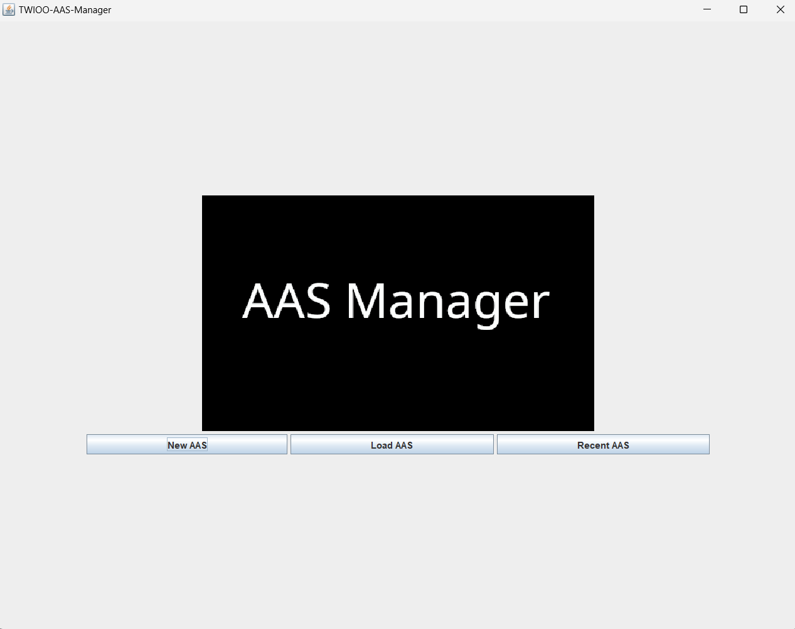

#### Subsystem: Popup Layer
- will show any popUp with a message/notification generated by other subsystems.

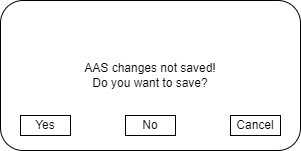
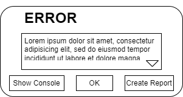
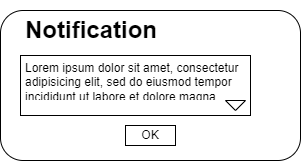

_Note: some other subsystem (e.g. AAS verifier) are or have error handler/-ing as well this should be referenced here and then described in detail in there own Subsystem Description._

#### Subsystem: AAS New Layer

1. **First Implementation:**
- create an empty AAS and directly jump into the edit Layer
- "empty" in the meaning of having a starting point to build an AAS (will be defined by how the AAS Object in the background will be handled)

2. **Second Implementation:**
- Template Manager 
- _Note: this needs to be checked with the Standards in regards to the question: "Is this the right/best way to implement it?"_

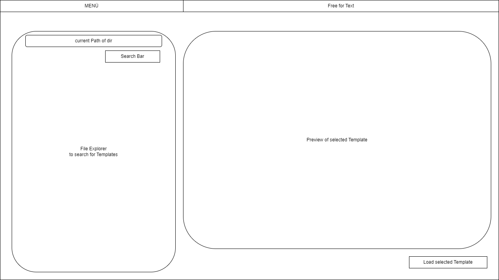

3. **Third Implementation:**
- will open an AAS creation dialog.
- will take simple mandatory inputs from the user:
    - kind of AAS
    - Name

- creates a guide through the process
- each step can be accessed individually
- the creation dialog is not mandatory (Skip button must implemented, also an option to (checkbox) to always skip the creation dialog)
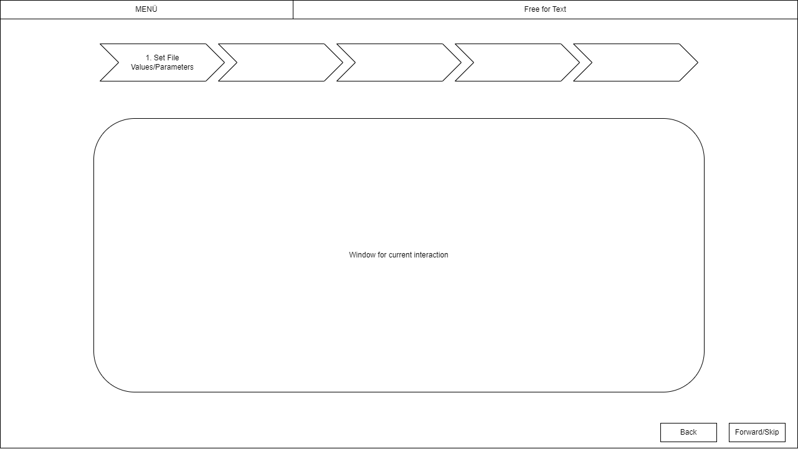

#### Subsystem: AAS Load Layer
1. **First Implementation:**
- Opening the OS File Explorer
- waiting for getting the filepath of desired AAS

2. **Second Implementation:**
- Opening a file Explorer inside the application with the looks of the application
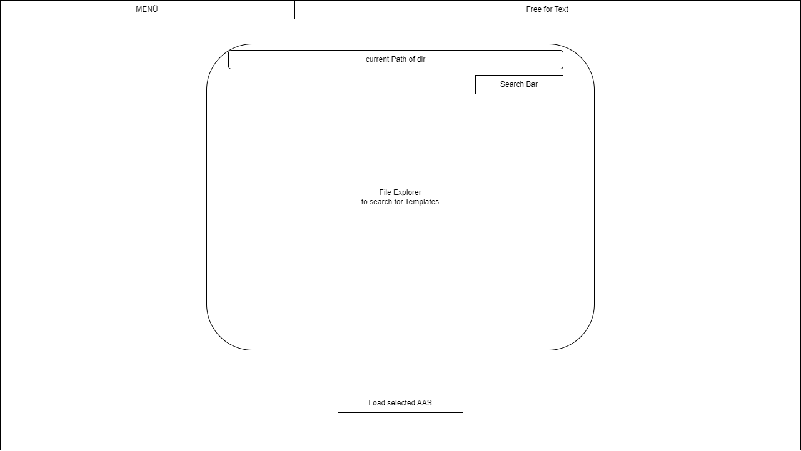

#### Subsystem: AAS Recent Layer
1. **First Implementation:**
- present a list of 10 last opened Files (History is only 10 Files long)
- give quick access to them by clicking onto them

2. **Second Implementation:**
- add: unlimited History (add counter to how the file was opened)
- add: function to delete entire history
- add: button behind entries to delete this one specific entry from history
- add: button to disable history (this will also translate as to a setting for menu bar)
- add: present a list of 10 most opened Files

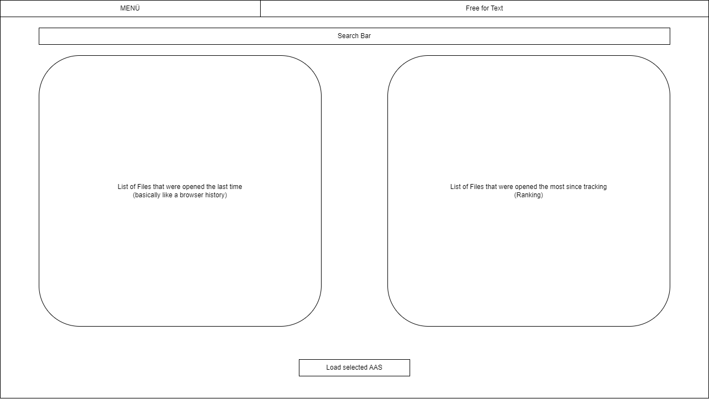

#### Subsystem: AAS View Layer
1. **First Implementation:**
- Presents the loaded AAS with View access
- blocks all edit tools
- reuse of Edit Layer for now

2. **Second Implementation:**
- ...

#### Subsystem: AAS Edit Layer
_Note: The Implementations are different Ideas and are not yet decided which to do first._

1. **First Implementation:**
- UML Diagram Style AAS Builder

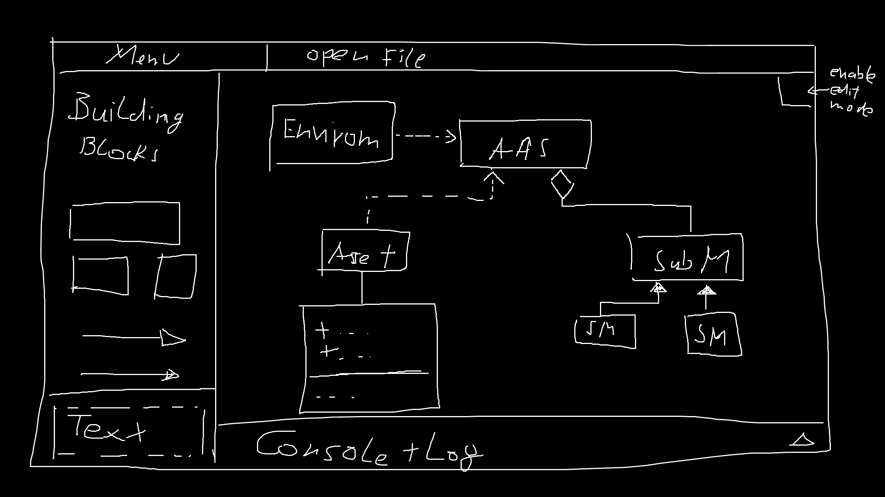

2. **Second Implementation:**
- Dropdown indention style.
- Basicly printing the structure of the AAS using Spoilers
- Sidescrollbar gives a high level preview of the entire AAS/ how it is opened inside the editor (like in VS-Code)

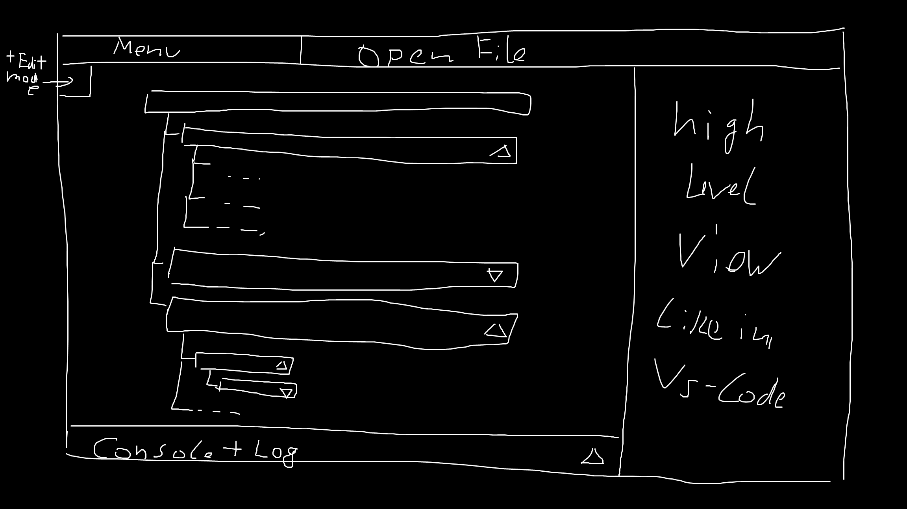

3. **Third Implementation:**
...

#### Subsystem: AAS Save Layer
... reuse of AAS Load Layer
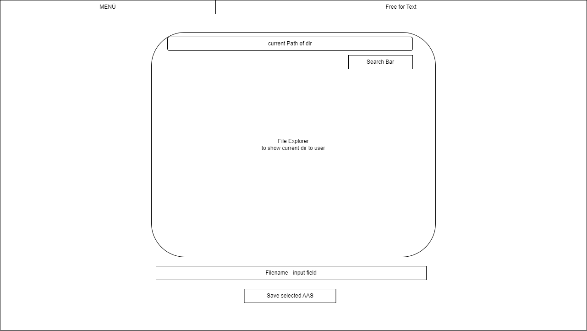

---

# Notes

- identify subsystems and choose for each a pattern as well
- explain why you choose this pattern
- add a general view diagram for the system and each subsystem. IMPORTANT: It should only show a very high level of abstraction.

### Main System Architecture and Sub Systems
_Note: From this point forward, there is no right Template. Just make sure to address every little detail and use a lot of diagrams. Always start with a bullet list of what you would put into the next Section sub section or diagram. Then decide if the level of detail is small enough. If not then the bullet list can be sub sections._

- architectural diagram of the proposed software product or application system
- details concerning the system design, e.g definitions, classifications, subsystems, interfaces, constraints, external interfaces, processes, etc.
- Descriptions of the data design and data structures
- The description of the proposed user interface including wire-frames if applicable
- Description of any API that you need to develop